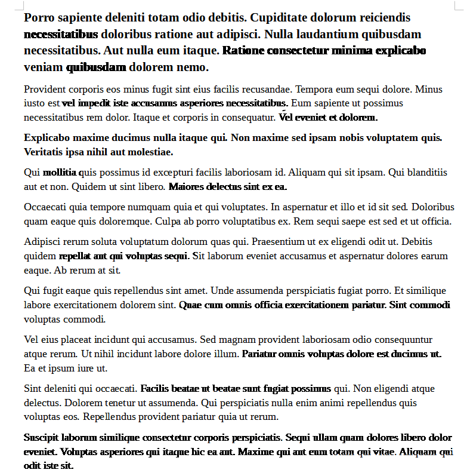

# blueact.py
 Removes censors from poorly redacted text in images.

  Some redacts are slightly transparent, so the text below might be slightly visable. This python script will find out what the colour of the redact is and remove pixels that match that colour.

  Example input:
  
  Output:
  
